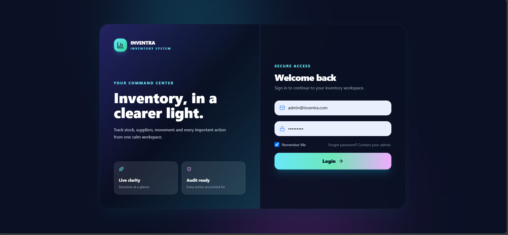
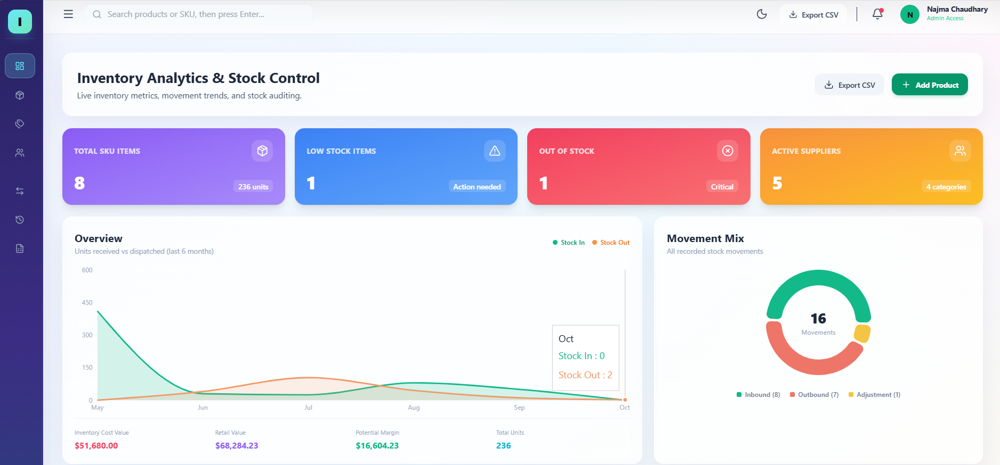
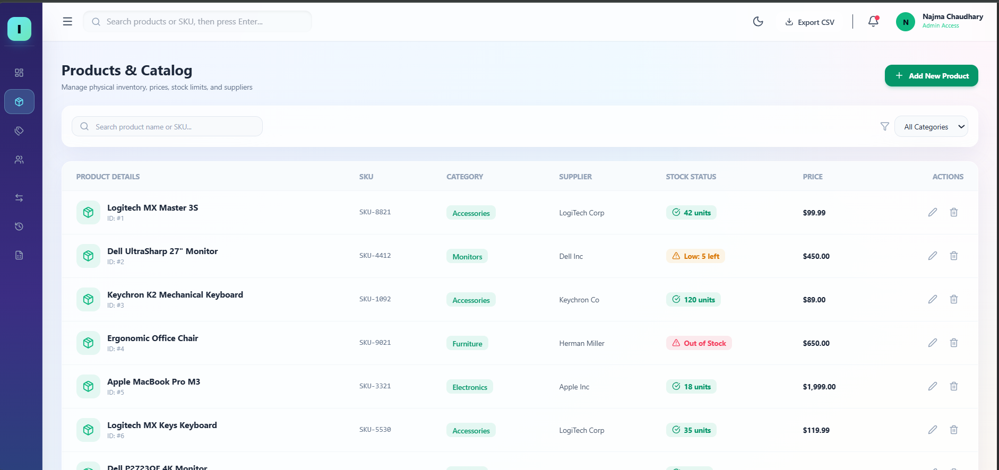
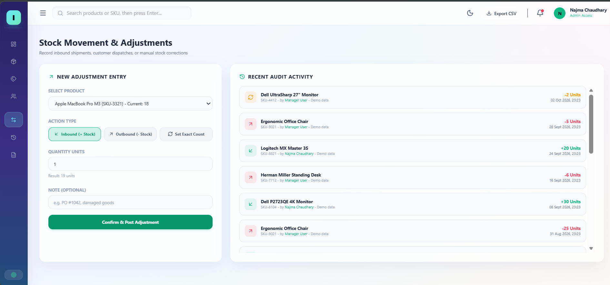
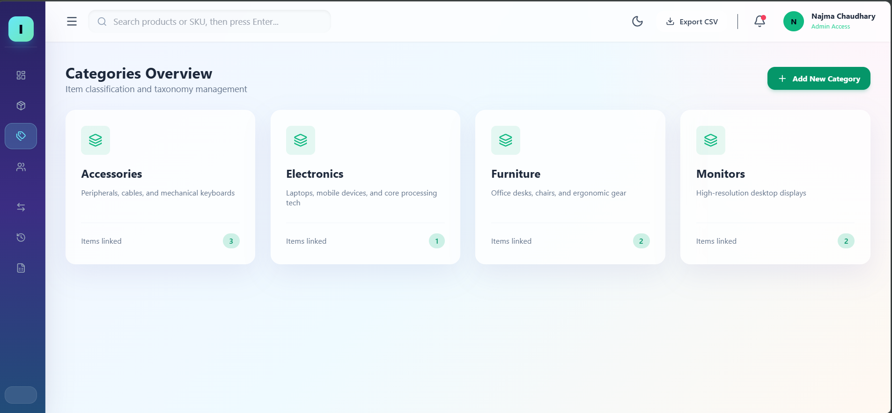
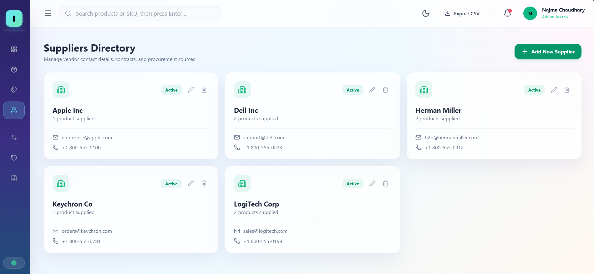
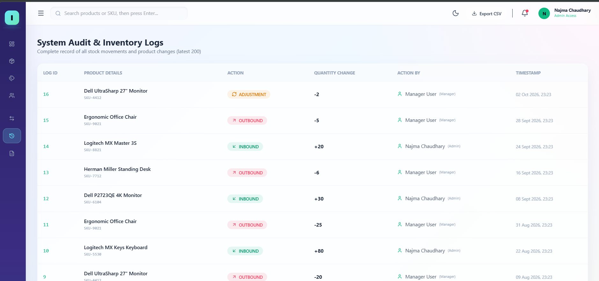
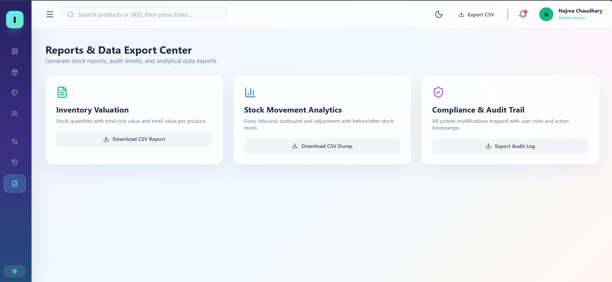

<div align="center">

# 📦 -Inventory-Management-System

**Track stock, suppliers and every important action from one calm workspace.**


</div>

---

## 📖 About

Inventra is a full-stack inventory management system. It started as a backend task (product CRUD, categories, stock management, inventory history, suppliers, images, pagination, search, sorting, filtering and CSV export) and was extended into a complete application with a React dashboard, role-based access control and a tamper-resistant audit trail.

## 📸 Screenshots

| Login | Dashboard |
|---|---|
|  |  |

| Products | Stock Movement |
|---|---|
|  |  |

| Categories | Suppliers |
|---|---|
|  |  |

| Audit Logs | Reports |
|---|---|
|  |  |

## ✨ Features

**Inventory**
- Product CRUD with SKU, category, supplier, pricing, reorder level and image upload
- Server-side search, category/supplier filters, sorting and pagination
- Colour-coded status: In Stock / Low Stock / Out of Stock

**Stock management**
- Inbound, Outbound and Set-Exact-Count adjustments
- Transaction-safe updates with row locking (`SELECT … FOR UPDATE`), so stock can never go negative or be oversold
- Every movement stored with before/after quantity, user and timestamp

**Dashboard & reports**
- Live KPIs, 6-month stock-in vs stock-out chart, movement mix, recent activity and low-stock alerts
- CSV exports: inventory, valuation, stock movements and full audit trail

**Security & access**
- JWT authentication, bcrypt password hashing, login rate limiting
- Role-based permissions (Admin / Manager / Staff)
- Whitelisted sorting and parameterised queries (no SQL injection), Helmet headers, upload type and size limits
- Audit log keeps product and user snapshots, so history survives deletions

**UI**
- Responsive layout, light and dark mode, toast notifications, form validation

## 🧱 Tech Stack

| Layer | Technology |
|---|---|
| Frontend | React 19, Vite, Tailwind CSS, Recharts, Lucide Icons |
| Backend | Node.js, Express 5, express-validator, Multer, json2csv |
| Database | PostgreSQL (normalised schema, indexes, constraints) |
| Auth | JSON Web Tokens, bcryptjs |

## 📁 Project Structure

```
inventra-system/
├── inventra-backend/
│   └── src/
│       ├── config/          # db pool, multer upload config
│       ├── controllers/     # auth, product, stock, category, supplier, dashboard, export
│       ├── middlewares/     # auth + roles, validation, error handler
│       ├── models/schema.sql
│       ├── routes/
│       ├── utils/           # query builder, audit helper, rate limiter, DB setup/seed
│       ├── validators/
│       └── app.js
├── inventra-frontend/
│   └── src/
│       ├── components/      # layout + reusable UI (Modal, Toast, StatusBadge)
│       ├── context/         # AuthContext
│       ├── pages/           # Dashboard, Products, Categories, Suppliers, Stock, Audit, Reports
│       └── services/api.js
├── postman/                 # ready-to-import API collection
└── screenshots/
```

## 🚀 Getting Started

### Prerequisites
- Node.js 18+
- PostgreSQL 14+ (pgAdmin optional)

### 1. Clone
```bash
git clone https://github.com/Najma-web-cell/inventra-inventory-management-system.git
cd inventra-inventory-management-system
```

### 2. Backend
```bash
cd inventra-backend
cp .env.example .env     # Windows: copy .env.example .env
```
Edit `.env` and set `DB_PASSWORD` and a long random `JWT_SECRET`:
```bash
node -e "console.log(require('crypto').randomBytes(48).toString('hex'))"
```
Create an empty PostgreSQL database (the name must match `DB_NAME`), then:
```bash
npm install
npm run db:setup         # creates tables + demo data
npm run dev              # http://localhost:5000
```
> ⚠️ `npm run db:setup` drops and recreates all tables in the configured database. Use a dedicated database.

### 3. Frontend
```bash
cd inventra-frontend
npm install
npm run dev              # http://localhost:5173
```
The Vite dev server proxies `/api` and `/uploads` to the backend, so no frontend `.env` is needed.

### 🔑 Demo accounts

| Role | Email | Password |
|---|---|---|
| Admin | admin@inventra.com | Admin@123 |
| Manager | manager@inventra.com | Manager@123 |
| Staff | staff@inventra.com | Staff@123 |

| Permission | Admin | Manager | Staff |
|---|:--:|:--:|:--:|
| View everything | ✅ | ✅ | ✅ |
| Inbound / Outbound stock | ✅ | ✅ | ✅ |
| Set exact stock count | ✅ | ✅ | ❌ |
| Create / edit products, categories, suppliers | ✅ | ✅ | ❌ |
| Delete records | ✅ | ❌ | ❌ |

## 🔌 API Overview

Base URL: `http://localhost:5000/api/v1` — all routes except login require `Authorization: Bearer <token>`.
Import `postman/Inventra.postman_collection.json` to try them instantly (run **Login** first, the token is saved automatically).

| Method | Endpoint | Description |
|---|---|---|
| POST | `/auth/login` | Login, returns JWT |
| GET | `/auth/me` | Current user |
| GET | `/dashboard/stats` | KPIs, monthly trend, alerts |
| GET | `/products` | `search`, `category_id`, `supplier_id`, `low_stock`, `out_of_stock`, `sort`, `page`, `limit` |
| POST / PUT | `/products` · `/products/:id` | Create / update (multipart with image) |
| DELETE | `/products/:id` | Delete (audit entry is kept) |
| POST | `/stock/adjust` | `IN` · `OUT` · `ADJUSTMENT` |
| GET | `/stock/logs` | Audit trail (`movements=true` for stock only) |
| GET · POST · PUT · DELETE | `/categories` · `/suppliers` | CRUD |
| GET | `/export/{products,valuation,movements,audit}` | CSV downloads |

## 🧠 Engineering Highlights

- **Normalised schema** with foreign keys, `CHECK` constraints and indexes on frequently filtered columns
- **Transactions + row locking** for every stock change
- **Reusable query builder** with whitelisted sort fields, capped page size and parameterised filters
- **Centralised error handling** that maps database errors (duplicate, invalid reference, constraint) to clear HTTP responses
- **Seed script** that rebuilds a demo-ready database in one command

## 🗺️ Roadmap

- [ ] Docker Compose setup
- [ ] Automated tests (Jest + Supertest)
- [ ] PDF report generation
- [ ] User management and password reset
- [ ] Live deployment

## 👩‍💻 Author

**Najma Chaudhary**
GitHub: [@Najma-web-cell](https://github.com/Najma-web-cell)

## 📄 License

MIT — free to use and modify.
